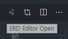
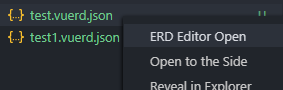

# erd-editor

> [erd-editor](https://github.com/dineug/erd-editor) Entity-Relationship Diagram Editor vscode extension

## ERD


## Usage

### [Webview API](https://code.visualstudio.com/api/extension-guides/webview)

1. Create `[any_filename].vuerd.json`
2. Open the file and click the Vuerd icon in the upper right corner of the Editor window **or** right click on file -> Open editor

     
   

### [Custom Editor API](https://code.visualstudio.com/api/extension-guides/custom-editors)

1. Create `[any_filename].vuerd`

### [Using Liquibase](https://www.liquibase.org/)

1. Create `[any_filename].vuerd.json` in the same folder as Liquibase changelog with name `changelog.xml`
2. Open Vuerd and `changelog.xml` will be automatically loaded
3. When exporting, set `changelog id` to the save location (if the location has changelog that was previously imported, Vuerd will try to add the changes to that file)

## Theme settings.json

### Synchronize the current vscode theme

```json
{
  "dineug.vuerd-vscode.themeSync": true,
  // will NOT synchronize the color list
  "dineug.vuerd-vscode.theme": {
    "keyPK": "#B4B400",
    "keyFK": "#dda8b1",
    "keyPFK": "#60b9c4",
    "edit": "#ffc107"
  }
}
```

### Example settings.json configuration for a light themed editor

```json
{
  "dineug.vuerd-vscode.themeSync": false,
  "dineug.vuerd-vscode.theme": {
    "canvas": "#d7d7d7",
    "table": "#e6e6e6",
    "tableActive": "#ebb692",
    "focus": "#ff5600",
    "keyPK": "#B4B400",
    "keyFK": "#dda8b1",
    "keyPFK": "#60b9c4",
    "font": "#5d5d5d",
    "fontActive": "black",
    "fontPlaceholder": "#929292",
    "contextmenu": "#e6e6e6",
    "contextmenuActive": "#c7c2be",
    "edit": "#003ef8",
    "columnSelect": "#dcd5d0",
    "columnActive": "#c8d6f7",
    "minimapShadow": "#5d5d5d",
    "scrollbarThumb": "#929292",
    "scrollbarThumbActive": "#5d5d5d",
    "menubar": "white",
    "visualization": "#d7d7d7"
  }
}
```

## Keymap settings.json

```json
{
  "dineug.vuerd-vscode.keymap": {
    "find": [
      {
        "altKey": true,
        "key": "F"
      }
    ],
    "selectAllColumn": [] // remove keymap
  }
}
```

## Document

- [Playground](https://vuerd.github.io)
- [Import SQL DDL support syntax](https://github.com/dineug/erd-editor/blob/master/packages/sql-ddl-parser/src/SQL_DDL_Test_Case.md)

## Editor Keymap(default)

| Name                                                       | Keymap                                                                                   |
| ---------------------------------------------------------- | ---------------------------------------------------------------------------------------- |
| Editing - ERD                                              | dblclick, Enter                                                                          |
| Editing - Grid                                             | dblclick, Enter                                                                          |
| All Stop                                                   | Escape                                                                                   |
| Search - find, filter                                      | Ctrl + F, Cmd + F                                                                        |
| Undo - ERD                                                 | Ctrl + Z, Cmd + Z                                                                        |
| Redo - ERD                                                 | Ctrl + Shift + Z, Cmd + Shift + Z                                                        |
| Selection - table, memo                                    | Ctrl + Drag, Click, Ctrl + Click, Ctrl + Alt + A, Cmd + Drag, Cmd + Click, Cmd + Alt + A |
| Selection - column, filter                                 | Click, Ctrl + Click, Cmd + Click, Shift + Click, Shift + Arrow key(up, down), Alt + A    |
| Movement - table, memo, column, filter                     | Drag, Ctrl + Drag, Cmd + Drag                                                            |
| Copy - column                                              | Ctrl + C, Cmd + C                                                                        |
| Paste - column                                             | Ctrl + V, Cmd + V                                                                        |
| Contextmenu - ERD, Table, Relationship, SQL, GeneratorCode | Right-click                                                                              |
| Table Properties                                           | Ctrl + Space, Alt + Space                                                                |
| New Table                                                  | Alt + N                                                                                  |
| New Memo                                                   | Alt + M                                                                                  |
| New - column, filter                                       | Alt + Enter                                                                              |
| Delete - table, memo                                       | Ctrl + Delete, Ctrl + Backspace, Cmd + Delete, Cmd + Backspace                           |
| Delete - column, filter                                    | Alt + Delete, Alt + Backspace                                                            |
| Select Hint - dataType, find                               | Arrow key(right), Click                                                                  |
| Move Hint - dataType, find                                 | Arrow key(up, down)                                                                      |
| Primary Key                                                | Alt + K                                                                                  |
| checkbox - Grid, filter                                    | Space, Click                                                                             |
| Move checkbox - Grid, filter                               | Arrow key(up, down, left, right)                                                         |
| Relationship - Zero One                                    | Ctrl + Alt + 1, Cmd + Alt + 1                                                            |
| Relationship - Zero N                                      | Ctrl + Alt + 2, Cmd + Alt + 2                                                            |
| Relationship - One Only                                    | Ctrl + Alt + 3, Cmd + Alt + 3                                                            |
| Relationship - One N                                       | Ctrl + Alt + 4, Cmd + Alt + 4                                                            |
| Zoom In - ERD                                              | Ctrl + Equal, Cmd + Equal                                                                |
| Zoom Out - ERD                                             | Ctrl + Minus, Cmd + Minus                                                                |
